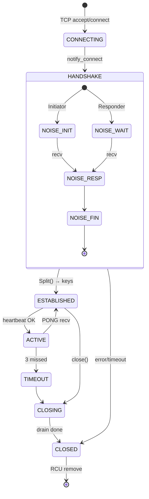

# Connection Lifecycle FSM

Полная state machine для connection от TCP accept до cleanup.

См. также: [ConnectionManager](../architecture/connection-manager.md) · [Noise FSM](../diagrams/noise-fsm.md)

## Connection FSM



## Heartbeat mechanism

**Параметры:**
- Интервал: 30 секунд
- Timeout: 3 missed PONG → disconnect

**Sequence:**

```
t=0s    A → B: PING(seq=1, timestamp)
        B → A: PONG(seq=1, timestamp)  ✓ missed=0

t=30s   A → B: PING(seq=2)
        B → A: PONG(seq=2)  ✓ missed=0

t=60s   A → B: PING(seq=3)
        [no response]  ✗ missed=1

t=90s   A → B: PING(seq=4)
        [no response]  ✗ missed=2

t=120s  A → B: PING(seq=5)
        [no response]  ✗ missed=3 → disconnect()
```

## RCU registry updates

**Connect:**
```
1. lock(records_write_mu_)
2. old = records_rcu_.load()
3. next = make_shared<RecordMap>(*old)  // copy
4. next->insert(conn_id, new_record)
5. records_rcu_.store(next)             // atomic swap
6. unlock()
```

**Disconnect:**
```
1. lock(records_write_mu_)
2. old = records_rcu_.load()
3. next = make_shared<RecordMap>(*old)  // copy
4. next->erase(conn_id)
5. records_rcu_.store(next)             // atomic swap
6. unlock()
```

**Read (hot path):**
```
auto map = records_rcu_.load(memory_order_acquire);  // no lock!
auto it = map->find(conn_id);
// работаем с it (shared_ptr keeps map alive)
```

**Свойство:** Readers видят consistent snapshot — либо старую карту, либо новую, но никогда partial state.

---

**См. также:** [ConnectionManager: RCU registry](../architecture/connection-manager.md#rcu-registry) · [Heartbeat](../architecture/connection-manager.md#heartbeat)
