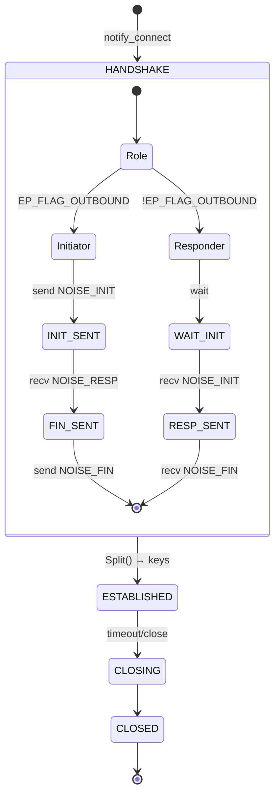

# Noise Handshake State Machine

Mermaid state diagram для Noise_XX handshake lifecycle.

См. также: [Noise_XX handshake](../protocol/noise-handshake.md) · [ConnectionManager](../architecture/connection-manager.md)

## Noise_XX FSM



## 3-message exchange

```
Initiator (EP_FLAG_OUTBOUND)     Responder (!EP_FLAG_OUTBOUND)
┌─────────────────────┐           ┌─────────────────────┐
│ 1. Generate e       │           │ 1. Wait             │
│ 2. Send NOISE_INIT  │──────────>│ 2. Recv NOISE_INIT  │
│    (→e + payload)   │           │ 3. Generate e       │
│                     │           │ 4. DH(ee, es)       │
│ 3. Recv NOISE_RESP  │<──────────│ 5. Send NOISE_RESP  │
│ 4. DH(ee, es)       │           │    (←e,ee,s,es)     │
│ 5. Send NOISE_FIN   │──────────>│ 6. Recv NOISE_FIN   │
│    (→s,se)          │           │ 7. DH(se)           │
│ 6. DH(se)           │           │ 8. Split() → keys   │
│ 7. Split() → keys   │           │                     │
└─────────────────────┘           └─────────────────────┘

       ESTABLISHED                       ESTABLISHED
```

## Error paths

| State | Error | Action |
|-------|-------|--------|
| Any handshake | timeout 30s | close_now |
| WAIT_INIT | bad magic | close_now |
| RESP_SENT | cross-verification fail | close_now |
| FIN_SENT | decrypt fail | close_now |
| Any | signature invalid | close_now |

**Cross-verification:** Ed25519 device_pk → X25519, сравнить с Noise remote static key (rs). Mismatch = identity substitution attempt.

---

**См. также:** [Noise_XX: детали](../protocol/noise-handshake.md#3-message-exchange) · [Connection FSM](data/projects/GoodNet/docs/diagrams/connection-fsm.md)
