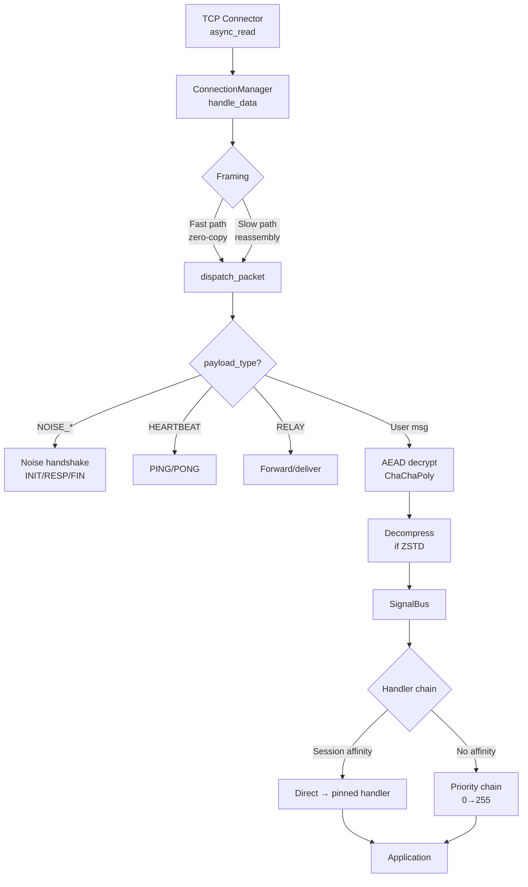
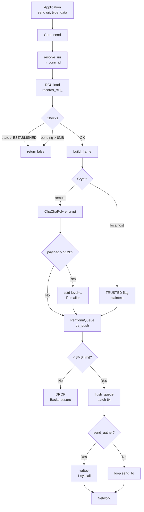

# Packet Flow Diagrams

Mermaid блок-схемы для packet-in и packet-out потоков.

См. также: [Обзор архитектуры](../architecture.md) · [ConnectionManager](../architecture/connection-manager.md)

## Packet-in (приём) — упрощённый



**Ключевые моменты:**
- **Fast path**: recv_buf пуст + полный фрейм → zero-copy dispatch
- **Slow path**: неполные данные → append recv_buf → reassembly loop
- **AEAD decrypt**: ChaChaPoly-IETF, nonce = 0x00[4] + packet_id[8]
- **Session affinity**: CONSUMED пинит handler → skip chain (~30x faster)

## Packet-out (отправка) — упрощённый



**Ключевые моменты:**
- **RCU**: atomic load → zero lock contention
- **Backpressure**: 8MB per-conn limit → DROP если превышен
- **Compression**: zstd level=1 для payload > 512B (если сжатие выгодно)
- **Batching**: flush до 64 frames за раз → меньше syscalls

## Data structures

```
ConnectionRecord {
  conn_id_t id
  conn_state_t state          // FSM: CONNECTING → HANDSHAKE → ESTABLISHED
  endpoint_t remote           // IP:port
  unique_ptr<NoiseSession>    // send_key, recv_key, handshake_hash
  atomic<uint64_t> send_packet_id
  atomic<uint64_t> recv_nonce_expected
  vector<uint8_t> recv_buf    // reassembly buffer
}

PerConnQueue {
  deque<vector<uint8_t>> frames
  atomic<size_t> pending_bytes  // backpressure tracking
  mutex mu
}
```

---

**См. также:** [ConnectionManager: dispatch path](../architecture/connection-manager.md#dispatch-path) · [ConnectionManager: send path](../architecture/connection-manager.md#send-path)
