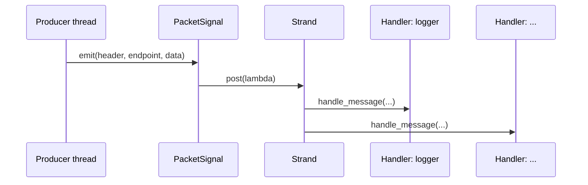
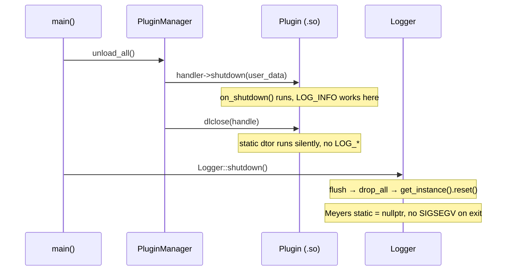

# GoodNet — Architecture

## Overview

GoodNet is a modular, high-performance C++23 network framework. The design separates a stable **core library** from independently deployable **plugins**, enabling the system to be extended at runtime without recompilation of the core.

```
┌─────────────────────────────────────────────────────────┐
│                       goodnet (binary)                  │
│                                                         │
│  main.cpp ──► Config ──► Logger ──► PluginManager       │
│                               │                         │
│              PacketSignal ◄───┘                         │
│              io_context + thread pool                   │
└─────────────┬───────────────────────────────────────────┘
              │  dlopen(RTLD_LOCAL)
   ┌──────────▼──────────┐   ┌──────────────────────────┐
   │  liblogger.so       │   │  libtcp.so               │
   │  (Handler plugin)   │   │  (Connector plugin)      │
   └─────────────────────┘   └──────────────────────────┘
```

---

## Core vs Plugins

### Core (`libgoodnet_core.so`)

The core is built as a **shared library**. It owns:

| Component | Responsibility |
|---|---|
| `PluginManager` | Loading, verifying, routing, and unloading plugins |
| `Logger` | Singleton logger (Meyers pattern), shared with plugins |
| `Config` | JSON-based runtime configuration |
| `PacketSignal` | Asynchronous packet routing via Boost.Asio strands |

The core is compiled as `SHARED` (not `STATIC`) deliberately. A static core embedded into both the executable and each plugin would create **duplicate static variables** — most critically, the Logger singleton. Two copies of `Logger::get_instance()` pointing to different objects would cause a double-init crash or a use-after-free SIGSEGV on shutdown. A single shared library instance eliminates this entirely.

### Plugins (`.so` files)

Each plugin is a separate shared library with a single exported C entry point (`handler_init` or `connector_init`). They are loaded at runtime with `dlopen(RTLD_LOCAL)`, which keeps plugin symbols private and prevents name collisions between plugins.

Plugins receive a `host_api_t*` from the core on initialization. This struct contains:
- A raw pointer to the core's `spdlog::logger` instance (for the logging bridge)
- Function pointers for sending packets and managing connections

**The plugin never links against `libgoodnet_core.so` directly.** It only depends on the GoodNet SDK headers. Symbol resolution happens at runtime through `dlopen`.

---

## IO and Thread Pool (Boost.Asio)

GoodNet uses `boost::asio::io_context` as its event loop. A fixed-size thread pool runs `ioc.run()` in parallel, giving every asynchronous operation a thread to execute on.

```cpp
boost::asio::io_context ioc;
auto work_guard = boost::asio::make_work_guard(ioc);

std::vector<std::thread> pool;
for (int i = 0; i < 12; ++i)
    pool.emplace_back([&ioc] { ioc.run(); });
```

`PacketSignal` uses a `boost::asio::strand` to serialize handler dispatch, preventing concurrent access to the handler list without a lock in the hot path.



---

## Packet Routing

Routing is done through a signal subscription. On startup, `main()` connects a lambda to `PacketSignal` that iterates all active handlers and calls `handle_message` for each one that has declared the incoming `payload_type` in its supported types list.

```cpp
packet_signal.connect([&manager](auto header, auto endpoint, auto data) {
    for (handler_t* plugin : manager.get_active_handlers()) {
        bool accepted = (plugin->num_supported_types == 0);
        for (size_t i = 0; !accepted && i < plugin->num_supported_types; ++i)
            accepted = (plugin->supported_types[i] == 0 ||
                        plugin->supported_types[i] == header->payload_type);
        if (accepted)
            plugin->handle_message(plugin->user_data, header.get(),
                                   endpoint, data->data(), data->size());
    }
});
```

A handler with `num_supported_types == 0` or with type `0` in its list receives every packet.

---

## Shutdown Sequence

Deterministic cleanup is the most critical part of GoodNet's design. The order is fixed in `main()` and must not be changed:

```
1.  work_guard.reset()        // Stop accepting new work
2.  thread pool join()         // Wait for all in-flight handlers to finish
3.  manager.unload_all()       // Shutdown plugins: call shutdown(), then dlclose()
4.  Logger::shutdown()         // flush → drop_all → get_instance().reset()
```



**Why this order matters:**

- `unload_all()` before `Logger::shutdown()` ensures plugins can still call `LOG_*` in their `on_shutdown()` method — the logger is alive.
- `get_instance().reset()` sets the Meyers singleton to `nullptr`. When the OS later calls `__do_global_dtors_aux` on `libgoodnet_core.so`, the `shared_ptr` destructor sees `nullptr` and skips `_M_dispose`. Without this reset, the destructor attempts to destroy an already-deallocated `spdlog` object → SIGSEGV.

---

## Directory Layout

```
GoodNet/
├── src/                    # Executable source (main.cpp, config.cpp, logger.cpp)
├── include/                # Core public headers (logger.hpp, config.hpp, ...)
├── core/                   # PluginManager implementation
├── sdk/                    # C ABI headers (types.h, handler.h, connector.h, plugin.h)
│   └── cpp/                # C++ SDK wrappers (IHandler, IConnector, plugin.hpp)
├── plugins/
│   ├── handlers/           # Handler plugin sources
│   │   └── logger/
│   └── connectors/         # Connector plugin sources
│       └── tcp/
├── cmake/                  # CMake helpers (pch.cmake, GoodNetConfig.cmake.in)
├── nix/                    # Nix build utilities (mkCppPlugin.nix, buildPlugin.nix)
├── docs/                   # This documentation
├── CMakeLists.txt
└── flake.nix
```
