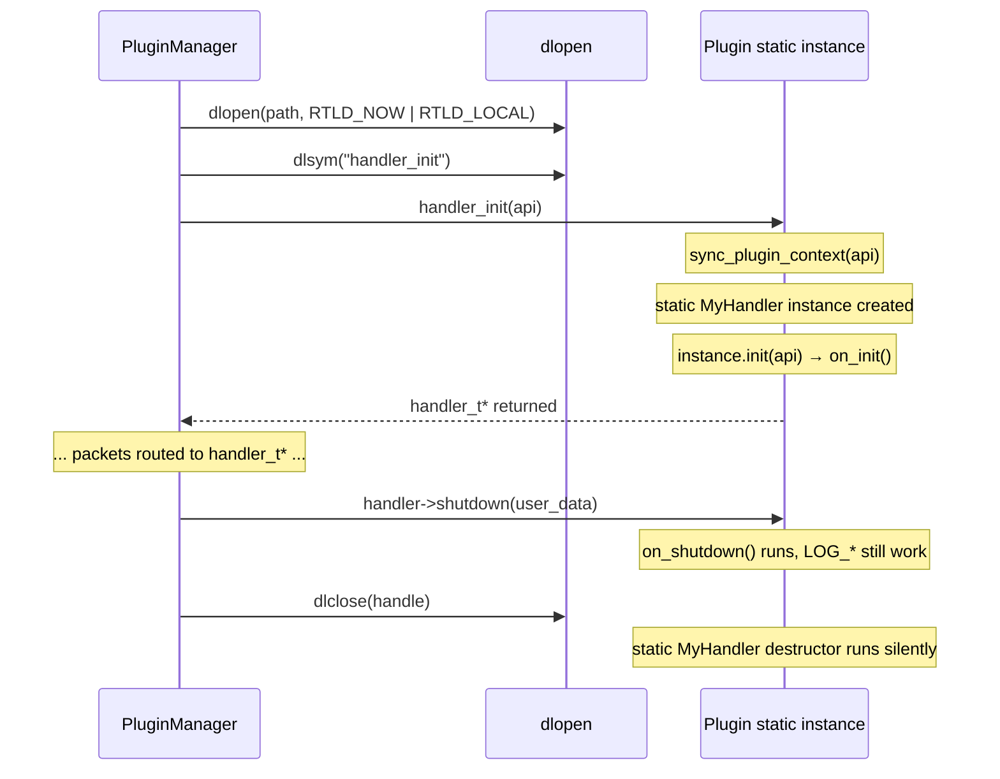

# GoodNet — Plugin Development Guide

## Concepts

GoodNet has two plugin types:

| Type | Base class | Entry point | Purpose |
|---|---|---|---|
| **Handler** | `gn::IHandler` | `handler_init` | Receives and processes packets |
| **Connector** | `gn::IConnector` | `connector_init` | Manages network connections |

Both are compiled as independent shared libraries (`.so`). The core loads them at runtime via `PluginManager`, passing a `host_api_t*` that gives the plugin access to the core's logger and send functions.

---

## Creating a Handler Plugin

### 1. Implement the class

```cpp
// plugins/handlers/my_handler/my_handler.cpp

#include <handler.hpp>   // gn::IHandler
#include <plugin.hpp>    // HANDLER_PLUGIN, sync_plugin_context
#include <logger.hpp>    // LOG_INFO, LOG_DEBUG, etc.

class MyHandler : public gn::IHandler {
public:
    const char* get_plugin_name() const override { return "MyHandler"; }

    void on_init() override {
        // Called once after the plugin is loaded and api_ is set.
        // Subscribe to message types: 0 means "all types".
        set_supported_types({MSG_TYPE_CHAT, MSG_TYPE_FILE});
        LOG_INFO("MyHandler initialized");
    }

    void handle_message(
        const header_t*  header,
        const endpoint_t* endpoint,
        const void*      payload,
        size_t           payload_size) override
    {
        LOG_DEBUG("Packet id={} type={} size={}",
                  header->packet_id, header->payload_type, payload_size);
        // process payload...
    }

    void handle_connection_state(const char* uri, conn_state_t state) override {
        LOG_INFO("Connection {}: state={}", uri, static_cast<int>(state));
    }

    void on_shutdown() override {
        LOG_INFO("MyHandler shutting down");
        // flush buffers, close files, etc.
    }
};

// Registers handler_init entry point
HANDLER_PLUGIN(MyHandler)
```

### 2. Write `CMakeLists.txt`

```cmake
cmake_minimum_required(VERSION 3.22)
set(CMAKE_CXX_STANDARD 23)
project(goodnet-my-handler)

find_package(GoodNet REQUIRED)
include(${GOODNET_SDK_HELPER})   # provides add_plugin()

add_plugin(my_handler my_handler.cpp)

# add extra dependencies if needed:
# target_link_libraries(my_handler PRIVATE fmt::fmt)
```

### 3. Write `default.nix`

```nix
{ pkgs, mkCppPlugin, goodnetSdk, ... }:

mkCppPlugin {
  name        = "my_handler";
  type        = "handlers";
  version     = "1.0.0";
  description = "Does something useful with packets";
  src         = ./.;
  deps        = [];       # add pkgs.boost etc. if needed
  inherit goodnetSdk;
}
```

Place the plugin directory at:
```
plugins/handlers/my_handler/
├── my_handler.cpp
├── CMakeLists.txt
└── default.nix
```

The Nix build discovers it automatically via `mapPlugins "handlers"` in `flake.nix`.

---

## Creating a Connector Plugin

```cpp
// plugins/connectors/my_connector/my_connector.cpp

#include <connector.hpp>
#include <plugin.hpp>
#include <logger.hpp>

class MyConnection : public gn::IConnection {
public:
    // ... implement do_send(), do_close(), is_connected(), etc.
};

class MyConnector : public gn::IConnector {
public:
    std::string get_scheme() const override { return "myproto"; }
    std::string get_name()   const override { return "My Protocol Connector"; }

    void on_init() override {
        LOG_INFO("MyConnector initialized");
    }

    std::unique_ptr<gn::IConnection> create_connection(const std::string& uri) override {
        // parse uri, establish connection, return IConnection
        return std::make_unique<MyConnection>(/* ... */);
    }

    bool start_listening(const std::string& host, uint16_t port) override {
        LOG_INFO("Listening on {}:{}", host, port);
        return true;
    }

    void on_shutdown() override {
        LOG_INFO("MyConnector shutting down");
    }
};

CONNECTOR_PLUGIN(MyConnector)
```

The `get_scheme()` string (`"myproto"`) becomes the key in `PluginManager::connectors_` and is used for lookup by `find_connector_by_scheme("myproto")`.

---

## How `HANDLER_PLUGIN` Works

The macro expands to the single exported C function the core looks for:

```cpp
#define HANDLER_PLUGIN(ClassName)                                 \
extern "C" GN_EXPORT handler_t* handler_init(host_api_t* api) {  \
    if (!api) return nullptr;                                     \
    sync_plugin_context(api);   /* (1) bridge logger */          \
    static ClassName instance;  /* (2) lazy singleton */         \
    instance.init(api);         /* (3) call on_init() */         \
    return instance.to_c_handler(); /* (4) return C struct */    \
}
```

1. **`sync_plugin_context(api)`** — sets up the plugin's logger (see below)
2. **`static ClassName instance`** — the plugin object is a static local: created once on first call to `handler_init`, destroyed when `dlclose()` unloads the library
3. **`instance.init(api)`** — stores `api_` and calls the virtual `on_init()`
4. **`to_c_handler()`** — wraps C++ virtual methods in C function pointer callbacks

`GN_EXPORT` marks the symbol as `visibility("default")` — it is the **only** exported symbol from the plugin. Everything else is hidden because the plugin is compiled with `-fvisibility=hidden` (set by `add_plugin()` in `helper.cmake`).

---

## `sync_plugin_context` — The No-Op Deleter Strategy

Plugins load with `RTLD_LOCAL`. This flag keeps the plugin's symbols private — it cannot accidentally override symbols in other plugins or the core. As a consequence, each plugin `.so` has its **own copy** of all static variables, including `Logger::get_instance()`. That copy starts as `nullptr`.

Without synchronization, the first `LOG_INFO(...)` inside a plugin would call `should_log()` → `ensure_initialized()` → tries to access `nullptr` → **SIGSEGV**.

The fix: the core passes a raw pointer to its logger through `api->internal_logger`. `sync_plugin_context` wraps it in a `shared_ptr` with a **no-op deleter**:

```cpp
inline void sync_plugin_context(host_api_t* api) {
    if (!api || !api->internal_logger) return;
    Logger::set_external_logger(
        std::shared_ptr<spdlog::logger>(
            static_cast<spdlog::logger*>(api->internal_logger),
            [](spdlog::logger*) noexcept {}  // no-op: core owns the object
        )
    );
}
```

| Without no-op deleter | With no-op deleter |
|---|---|
| `dlclose()` → `shared_ptr` dtor → `delete logger` → double-free | `dlclose()` → `shared_ptr` dtor → lambda called → nothing happens |

The core's `Logger::shutdown()` is the sole owner responsible for destroying the `spdlog::logger` object. Plugins borrow it for their lifetime and release the borrow cleanly on unload.

---

## RTLD_LOCAL vs RTLD_GLOBAL

| Flag | Symbol visibility | Use case |
|---|---|---|
| `RTLD_LOCAL` | Plugin symbols are private | GoodNet plugins — isolation, no collisions |
| `RTLD_GLOBAL` | Plugin symbols go into the global namespace | Embedded interpreters (Python, Lua) that need their symbols globally visible |

GoodNet originally used `RTLD_GLOBAL` as a shortcut: it allowed plugins to resolve `Logger::logger_` directly from the core's symbol table. This worked but had a fragile downside — any name collision between a plugin symbol and a core symbol would produce silent wrong-function calls.

The current design with `RTLD_LOCAL` + explicit logger bridge is safer and explicit. Plugins have zero shared symbols with the core at the `dlopen` level; the only communication channel is the `host_api_t*` struct.

---

## Plugin Integrity Verification

Every plugin built through the Nix pipeline is accompanied by a JSON manifest (`libname.so.json`):

```json
{
  "meta": {
    "name": "my_handler",
    "type": "handlers",
    "version": "1.0.0",
    "description": "Does something useful with packets",
    "timestamp": "2026-03-03T00:00:00Z"
  },
  "integrity": {
    "alg": "sha256",
    "hash": "e3b0c44298fc1c149afb..."
  }
}
```

`PluginManager::load_all_plugins()` verifies the SHA-256 of each `.so` against its manifest before calling `dlopen`. A plugin with a missing or mismatched manifest is skipped with an error log. For development builds, manifests can be generated locally using the `gen-manifests` CMake target.

---

## Plugin Lifecycle Summary


