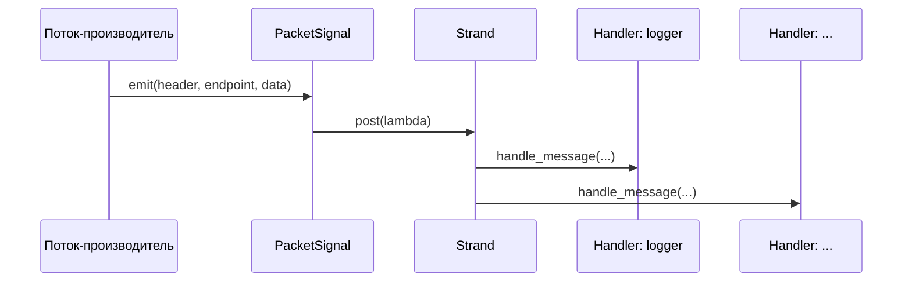
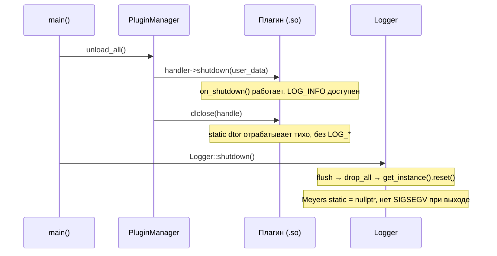

# GoodNet — Архитектура

## Обзор

GoodNet — это модульный высокопроизводительный фреймворк для сетевых приложений на C++23. Архитектура разделяет стабильную **библиотеку ядра** и независимо разворачиваемые **плагины**, что позволяет расширять систему в рантайме без перекомпиляции ядра.

```
┌─────────────────────────────────────────────────────────┐
│                       goodnet (бинарник)                │
│                                                         │
│  main.cpp ──► Config ──► Logger ──► PluginManager       │
│                               │                         │
│              PacketSignal ◄───┘                         │
│              io_context + thread pool                   │
└─────────────┬───────────────────────────────────────────┘
              │  dlopen(RTLD_LOCAL)
   ┌──────────▼──────────┐   ┌──────────────────────────┐
   │  liblogger.so       │   │  libtcp.so               │
   │  (Handler-плагин)   │   │  (Connector-плагин)      │
   └─────────────────────┘   └──────────────────────────┘
```

---

## Ядро и плагины

### Ядро (`libgoodnet_core.so`)

Ядро собирается как **разделяемая библиотека**. Оно владеет:

| Компонент | Ответственность |
|---|---|
| `PluginManager` | Загрузка, верификация, маршрутизация и выгрузка плагинов |
| `Logger` | Singleton-логгер (паттерн Meyers), разделяемый с плагинами |
| `Config` | Конфигурация из JSON-файла |
| `PacketSignal` | Асинхронная маршрутизация пакетов через Boost.Asio strands |

Ядро намеренно собирается как `SHARED`, а не `STATIC`. Статическое ядро, встроенное и в исполняемый файл, и в каждый плагин, создало бы **дублирующиеся статические переменные** — прежде всего синглтон Logger. Две копии `Logger::get_instance()`, указывающие на разные объекты, вызвали бы двойную инициализацию или use-after-free при завершении. Единственная разделяемая библиотека полностью устраняет эту проблему.

### Плагины (`.so`-файлы)

Каждый плагин — это отдельная разделяемая библиотека с единственной экспортируемой точкой входа на C (`handler_init` или `connector_init`). Плагины загружаются в рантайме через `dlopen(RTLD_LOCAL)`, что изолирует их символы и исключает конфликты имён между плагинами.

Плагины получают `host_api_t*` от ядра при инициализации. Эта структура содержит:
- Сырой указатель на экземпляр `spdlog::logger` ядра (для моста логирования)
- Указатели на функции отправки пакетов и управления соединениями

**Плагин никогда не линкуется с `libgoodnet_core.so` напрямую.** Он зависит только от заголовков GoodNet SDK. Разрешение символов происходит в рантайме через `dlopen`.

---

## I/O и thread pool (Boost.Asio)

GoodNet использует `boost::asio::io_context` как цикл событий. Пул фиксированного размера запускает `ioc.run()` параллельно, предоставляя каждой асинхронной операции поток для выполнения.

```cpp
boost::asio::io_context ioc;
auto work_guard = boost::asio::make_work_guard(ioc);

std::vector<std::thread> pool;
for (int i = 0; i < 12; ++i)
    pool.emplace_back([&ioc] { ioc.run(); });
```

`PacketSignal` использует `boost::asio::strand` для сериализации вызовов обработчиков — без блокировок в горячем пути.



---

## Маршрутизация пакетов

Маршрутизация реализована через подписку на сигнал. При запуске `main()` подключает лямбду к `PacketSignal`, которая перебирает все активные обработчики и вызывает `handle_message` для каждого, объявившего входящий `payload_type` в списке поддерживаемых типов.

```cpp
packet_signal.connect([&manager](auto header, auto endpoint, auto data) {
    for (handler_t* plugin : manager.get_active_handlers()) {
        bool accepted = (plugin->num_supported_types == 0);
        for (size_t i = 0; !accepted && i < plugin->num_supported_types; ++i)
            accepted = (plugin->supported_types[i] == 0 ||
                        plugin->supported_types[i] == header->payload_type);
        if (accepted)
            plugin->handle_message(plugin->user_data, header.get(),
                                   endpoint, data->data(), data->size());
    }
});
```

Обработчик с `num_supported_types == 0` или с типом `0` в списке получает каждый пакет.

---

## Последовательность завершения

Детерминированный shutdown — наиболее критичная часть архитектуры GoodNet. Порядок зафиксирован в `main()` и не должен меняться:

```
1.  work_guard.reset()       // Прекратить принимать новую работу
2.  thread pool join()       // Дождаться завершения всех in-flight обработчиков
3.  manager.unload_all()     // Shutdown плагинов: вызов shutdown(), затем dlclose()
4.  Logger::shutdown()       // flush → drop_all → get_instance().reset()
```



**Почему важен порядок:**

- `unload_all()` до `Logger::shutdown()` гарантирует, что плагины могут вызывать `LOG_*` в своём `on_shutdown()` — логгер ещё жив.
- `get_instance().reset()` устанавливает Meyers singleton в `nullptr`. Когда ОС вызывает `__do_global_dtors_aux` на `libgoodnet_core.so`, деструктор `shared_ptr` видит `nullptr` и пропускает `_M_dispose`. Без этого `reset()` деструктор попытается уничтожить уже освобождённый объект `spdlog` → SIGSEGV.

---

## Структура директорий

```
GoodNet/
├── src/                    # Исходники исполняемого файла (main.cpp, config.cpp, logger.cpp)
├── include/                # Публичные заголовки ядра (logger.hpp, config.hpp, ...)
├── core/                   # Реализация PluginManager
├── sdk/                    # C ABI заголовки (types.h, handler.h, connector.h, plugin.h)
│   └── cpp/                # C++ обёртки SDK (IHandler, IConnector, plugin.hpp)
├── plugins/
│   ├── handlers/           # Исходники Handler-плагинов
│   │   └── logger/
│   └── connectors/         # Исходники Connector-плагинов
│       └── tcp/
├── cmake/                  # Вспомогательные файлы CMake (pch.cmake, GoodNetConfig.cmake.in)
├── nix/                    # Утилиты сборки Nix (mkCppPlugin.nix, buildPlugin.nix)
├── docs/
│   ├── en/                 # Документация на английском
│   └── ru/                 # Документация на русском
├── CMakeLists.txt
└── flake.nix
```
