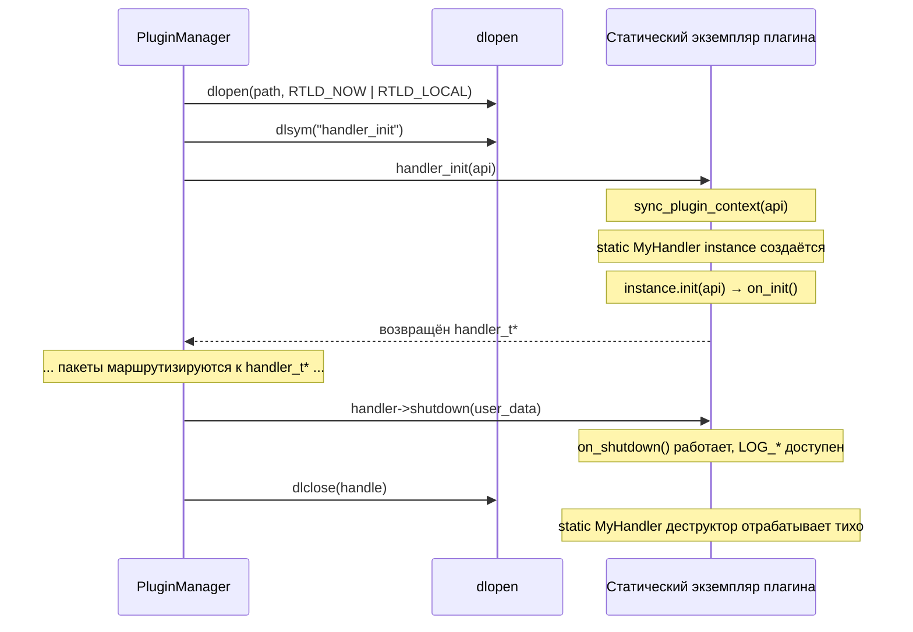

# GoodNet — Руководство по разработке плагинов

## Концепция

В GoodNet два типа плагинов:

| Тип | Базовый класс | Точка входа | Назначение |
|---|---|---|---|
| **Handler** | `gn::IHandler` | `handler_init` | Получает и обрабатывает пакеты |
| **Connector** | `gn::IConnector` | `connector_init` | Управляет сетевыми соединениями |

Оба компилируются как независимые разделяемые библиотеки (`.so`). Ядро загружает их в рантайме через `PluginManager`, передавая `host_api_t*` с доступом к логгеру ядра и функциям отправки данных.

---

## Создание Handler-плагина

### 1. Реализовать класс

```cpp
// plugins/handlers/my_handler/my_handler.cpp

#include <handler.hpp>   // gn::IHandler
#include <plugin.hpp>    // HANDLER_PLUGIN, sync_plugin_context
#include <logger.hpp>    // LOG_INFO, LOG_DEBUG и т.д.

class MyHandler : public gn::IHandler {
public:
    const char* get_plugin_name() const override { return "MyHandler"; }

    void on_init() override {
        // Вызывается один раз после загрузки плагина, api_ уже установлен.
        // Подписка на типы сообщений: 0 означает «все типы».
        set_supported_types({MSG_TYPE_CHAT, MSG_TYPE_FILE});
        LOG_INFO("MyHandler инициализирован");
    }

    void handle_message(
        const header_t*  header,
        const endpoint_t* endpoint,
        const void*      payload,
        size_t           payload_size) override
    {
        LOG_DEBUG("Пакет id={} type={} size={}",
                  header->packet_id, header->payload_type, payload_size);
        // обработка payload...
    }

    void handle_connection_state(const char* uri, conn_state_t state) override {
        LOG_INFO("Соединение {}: state={}", uri, static_cast<int>(state));
    }

    void on_shutdown() override {
        LOG_INFO("MyHandler завершает работу");
        // сброс буферов, закрытие файлов и т.д.
    }
};

// Регистрирует точку входа handler_init
HANDLER_PLUGIN(MyHandler)
```

### 2. Написать `CMakeLists.txt`

```cmake
cmake_minimum_required(VERSION 3.22)
set(CMAKE_CXX_STANDARD 23)
project(goodnet-my-handler)

find_package(GoodNet REQUIRED)
include(${GOODNET_SDK_HELPER})   # предоставляет add_plugin()

add_plugin(my_handler my_handler.cpp)

# Дополнительные зависимости при необходимости:
# target_link_libraries(my_handler PRIVATE fmt::fmt)
```

### 3. Написать `default.nix`

```nix
{ pkgs, mkCppPlugin, goodnetSdk, ... }:

mkCppPlugin {
  name        = "my_handler";
  type        = "handlers";
  version     = "1.0.0";
  description = "Делает что-то полезное с пакетами";
  src         = ./.;
  deps        = [];       # добавьте pkgs.boost и т.п. при необходимости
  inherit goodnetSdk;
}
```

Разместить директорию плагина по пути:
```
plugins/handlers/my_handler/
├── my_handler.cpp
├── CMakeLists.txt
└── default.nix
```

Nix-сборка обнаружит его автоматически через `mapPlugins "handlers"` в `flake.nix`.

---

## Создание Connector-плагина

```cpp
// plugins/connectors/my_connector/my_connector.cpp

#include <connector.hpp>
#include <plugin.hpp>
#include <logger.hpp>

class MyConnection : public gn::IConnection {
public:
    // ... реализовать do_send(), do_close(), is_connected() и т.д.
};

class MyConnector : public gn::IConnector {
public:
    std::string get_scheme() const override { return "myproto"; }
    std::string get_name()   const override { return "My Protocol Connector"; }

    void on_init() override {
        LOG_INFO("MyConnector инициализирован");
    }

    std::unique_ptr<gn::IConnection> create_connection(const std::string& uri) override {
        // разобрать uri, установить соединение, вернуть IConnection
        return std::make_unique<MyConnection>(/* ... */);
    }

    bool start_listening(const std::string& host, uint16_t port) override {
        LOG_INFO("Слушаем {}:{}", host, port);
        return true;
    }

    void on_shutdown() override {
        LOG_INFO("MyConnector завершает работу");
    }
};

CONNECTOR_PLUGIN(MyConnector)
```

Строка `get_scheme()` (`"myproto"`) становится ключом в `PluginManager::connectors_` и используется для поиска через `find_connector_by_scheme("myproto")`.

---

## Как работает `HANDLER_PLUGIN`

Макрос разворачивается в единственную экспортируемую C-функцию, которую ищет ядро:

```cpp
#define HANDLER_PLUGIN(ClassName)                                 \
extern "C" GN_EXPORT handler_t* handler_init(host_api_t* api) {  \
    if (!api) return nullptr;                                     \
    sync_plugin_context(api);   /* (1) мост логгера */           \
    static ClassName instance;  /* (2) ленивый singleton */      \
    instance.init(api);         /* (3) вызов on_init() */        \
    return instance.to_c_handler(); /* (4) C-структура */        \
}
```

1. **`sync_plugin_context(api)`** — настраивает логгер плагина (см. ниже)
2. **`static ClassName instance`** — объект плагина является статической локальной переменной: создаётся один раз при первом вызове `handler_init`, уничтожается при `dlclose()`
3. **`instance.init(api)`** — сохраняет `api_` и вызывает виртуальный `on_init()`
4. **`to_c_handler()`** — оборачивает виртуальные методы C++ в C-коллбэки

`GN_EXPORT` помечает символ как `visibility("default")` — это **единственный** экспортируемый символ плагина. Всё остальное скрыто, поскольку плагин компилируется с `-fvisibility=hidden` (устанавливается в `add_plugin()` в `helper.cmake`).

---

## `sync_plugin_context` — стратегия no-op deleter

Плагины загружаются с `RTLD_LOCAL`. Этот флаг изолирует символы плагина — они не могут случайно переопределить символы других плагинов или ядра. Как следствие, каждое `.so` имеет **собственную копию** всех статических переменных, включая `Logger::get_instance()`. Эта копия изначально равна `nullptr`.

Без синхронизации первый `LOG_INFO(...)` в плагине вызвал бы `should_log()` → `ensure_initialized()` → обращение к `nullptr` → **SIGSEGV**.

Решение: ядро передаёт сырой указатель на свой логгер через `api->internal_logger`. `sync_plugin_context` оборачивает его в `shared_ptr` с **no-op deleter**:

```cpp
inline void sync_plugin_context(host_api_t* api) {
    if (!api || !api->internal_logger) return;
    Logger::set_external_logger(
        std::shared_ptr<spdlog::logger>(
            static_cast<spdlog::logger*>(api->internal_logger),
            [](spdlog::logger*) noexcept {}  // no-op: ядро владеет объектом
        )
    );
}
```

| Без no-op deleter | С no-op deleter |
|---|---|
| `dlclose()` → `~shared_ptr` → `delete logger` → двойное удаление | `dlclose()` → `~shared_ptr` → лямбда вызвана → ничего не происходит |

`Logger::shutdown()` ядра — единственный владелец объекта `spdlog::logger`. Плагины заимствуют его на время жизни и корректно освобождают заимствование при выгрузке.

---

## RTLD_LOCAL vs RTLD_GLOBAL

| Флаг | Видимость символов | Сценарий использования |
|---|---|---|
| `RTLD_LOCAL` | Символы плагина приватны | Плагины GoodNet — изоляция, нет коллизий |
| `RTLD_GLOBAL` | Символы плагина уходят в глобальное пространство | Встроенные интерпретаторы (Python, Lua), которым нужна глобальная видимость символов |

GoodNet изначально использовал `RTLD_GLOBAL` как упрощение: это позволяло плагинам разрешать `Logger::logger_` напрямую из таблицы символов ядра. Это работало, но имело хрупкий недостаток — любой конфликт имён между символом плагина и символом ядра приводил к молчаливому вызову неправильной функции.

Текущая архитектура с `RTLD_LOCAL` + явным мостом логгера — безопаснее и явнее. Между плагинами и ядром нет разделяемых символов на уровне `dlopen`; единственный канал коммуникации — структура `host_api_t*`.

---

## Верификация плагинов

Каждый плагин, собранный через Nix-пайплайн, сопровождается JSON-манифестом (`libname.so.json`):

```json
{
  "meta": {
    "name": "my_handler",
    "type": "handlers",
    "version": "1.0.0",
    "description": "Делает что-то полезное с пакетами",
    "timestamp": "2026-03-03T00:00:00Z"
  },
  "integrity": {
    "alg": "sha256",
    "hash": "e3b0c44298fc1c149afb..."
  }
}
```

`PluginManager::load_all_plugins()` верифицирует SHA-256 каждого `.so` по манифесту перед вызовом `dlopen`. Плагин с отсутствующим или несовпадающим манифестом пропускается с записью об ошибке в лог. Для ручных dev-сборок манифесты можно сгенерировать через CMake-таргет `gen-manifests`.

---

## Жизненный цикл плагина


